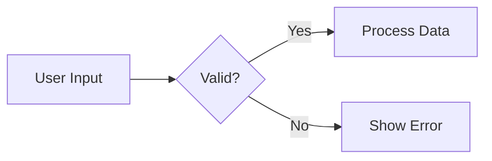
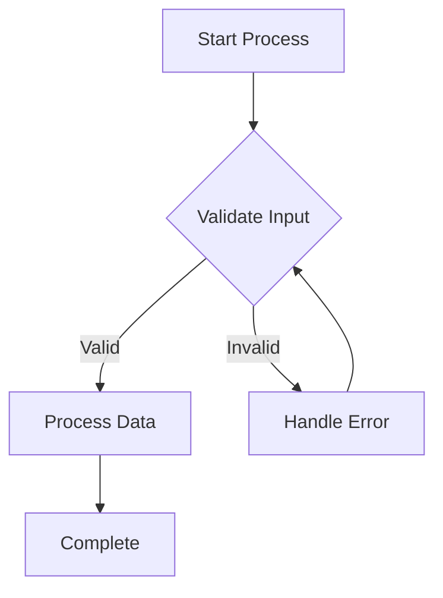
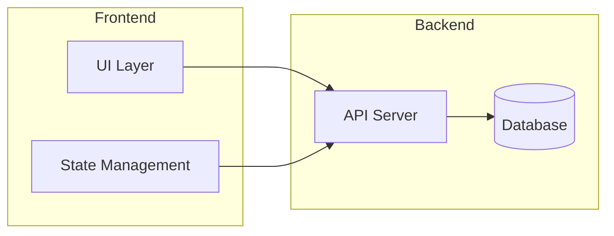
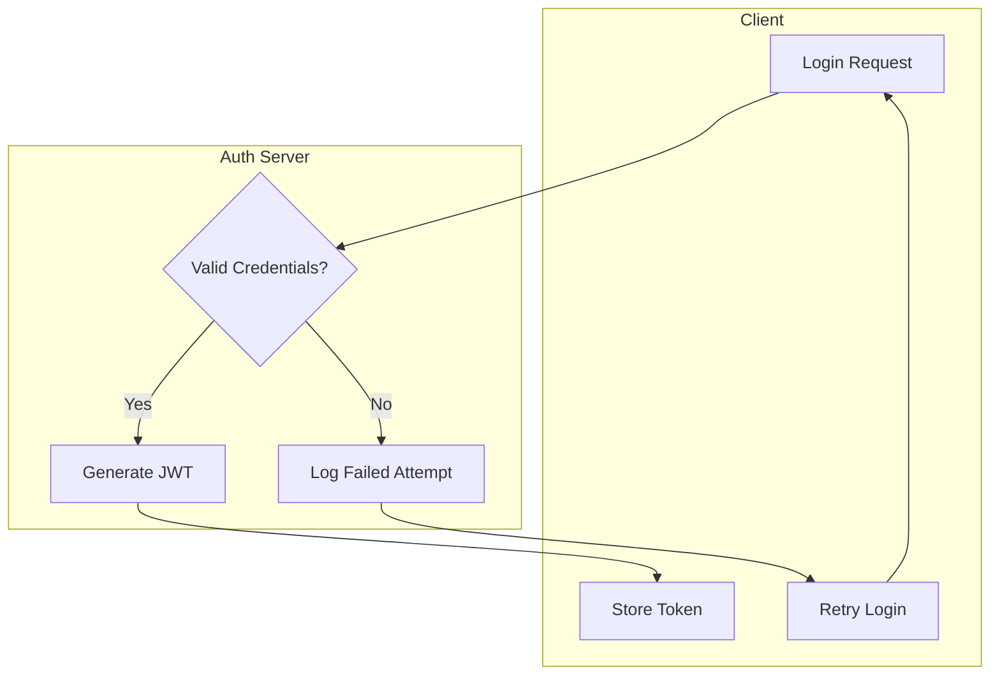

# Mermaid Diagram Skill

Create professional Mermaid diagrams with proper syntax, clear layout, and validated output.

## Prerequisites

The Mermaid CLI (`mmdc`) must be available. Install via `npm install -g @mermaid-js/mermaid-cli` if needed.

## Workflow Overview

1. **Choose Diagram Type** - Select the appropriate diagram type for your use case
2. **Write Diagram** - Use idiomatic patterns and clear naming
3. **Validate Syntax** - Run through mmdc to catch syntax errors
4. **Review Diagram Code** - Check for common issues
5. **Visual Review** - Check the rendered output for layout issues
6. **Iterate** - Refine based on feedback

## Diagram Type Selection

| Type | Best For | Key Indicator |
|------|----------|---------------|
| **Flowchart** | Processes, decisions, algorithms, workflows | "How does X flow?" or "What are the steps?" |
| **Sequence Diagram** | API calls, message passing, interactions over time | "How do components communicate?" |
| **State Diagram** | State machines, object lifecycles, status transitions | "What states can X be in?" |
| **Class Diagram** | OOP design, type relationships, inheritance | "What are the types and their relationships?" |
| **ER Diagram** | Database schemas, data models, table relationships | "What data do we store and how is it related?" |
| **Architecture** | System components, services, infrastructure | "What are the high-level components?" |

For detailed syntax and examples of each type, see `references/diagram-types.md`.

## Idiomatic Patterns

### Use Self-Explanatory Node IDs

Good - IDs describe the node:


Bad - Cryptic IDs:


### Declare Nodes Before Connections

For complex diagrams, declare nodes first, then define connections:



### Use Subgraphs for Logical Grouping



### Direction Guidelines

| Direction | Code | Best For |
|-----------|------|----------|
| Top to Bottom | `TD` or `TB` | Hierarchies, decision trees |
| Left to Right | `LR` | Timelines, processes, pipelines |
| Bottom to Top | `BT` | Bottom-up flows |
| Right to Left | `RL` | Reverse flows |

## Validation Workflow

### Step 1: Syntax Validation

Save your diagram to a `.mmd` file and validate:

```bash
uv run scripts/validate_mermaid.py diagram.mmd --output diagram.svg
```

The script will report syntax errors with line numbers.

The validation script uses a default config (`scripts/mermaid-config.json`) that prevents text clipping by using arial font and increased padding. To use a custom config or disable it:

```bash
# Custom config
uv run scripts/validate_mermaid.py diagram.mmd -c my-config.json

# No config (use mmdc defaults)
uv run scripts/validate_mermaid.py diagram.mmd --no-config
```

### Step 2: Visual Quality Review

After syntax validation passes, review the rendered output for:

- [ ] **Readability**: All text is legible, no overlapping labels
- [ ] **Edge Crossings**: Minimized (try different direction if excessive)
- [ ] **Logical Grouping**: Related nodes grouped in subgraphs where beneficial
- [ ] **Consistent Shapes**: Same node shape for similar concepts
- [ ] **Flow Direction**: Consistent and intuitive (usually LR for processes, TD for hierarchies)
- [ ] **Labels**: Edge labels present where needed for clarity
- [ ] **Spacing**: Nodes not too cramped or too spread out
- [ ] **Color Usage**: Styling aids understanding, not just decoration

### Step 3: Common Fixes

If the diagram renders but looks wrong:

| Issue | Fix |
|-------|-----|
| Too many edge crossings | Try different direction (LR vs TD) |
| Nodes too cramped | Add line breaks in labels: `node["Line 1<br/>Line 2"]` |
| Subgraphs overlapping | Reduce nesting depth or split into multiple diagrams |
| Arrows going wrong way | Check connection order: `from --> to` |

## Reference Files

- `references/diagram-types.md` - Full syntax and examples for flowcharts, sequence, state, class, ER, and architecture diagrams
- `references/syntax-quick-ref.md` - Node shapes, arrow types, styling classes, text formatting, and escape sequences
- `references/layout-patterns.md` - Subgraph organization, nesting strategies, and direction optimization
- `references/common-issues.md` - Parse errors, reserved words, text clipping fixes, and debugging steps

## Example: Complete Workflow

Creating an authentication flow diagram:

1. **Choose type**: Flowchart (it's a process with decisions)

2. **Write diagram**:


3. **Validate**:
```bash
uv run scripts/validate_mermaid.py auth-flow.mmd --output auth-flow.svg
```

4. **Review**: Check the SVG output for readability

5. **Iterate**: Adjust direction, add styling if needed
