# Mermaid Layout Patterns

Best practices for organizing complex diagrams with subgraphs, nesting, and layout strategies.

## When to Use Subgraphs

Use subgraphs to:
- Group related nodes logically (e.g., by service, layer, or domain)
- Create visual boundaries between concerns
- Add labels to groups of nodes
- Apply consistent styling to groups

Avoid subgraphs when:
- The diagram has fewer than 6-8 nodes
- Grouping doesn't add clarity
- It creates unnecessary nesting

## Subgraph Best Practices

### Clear Naming

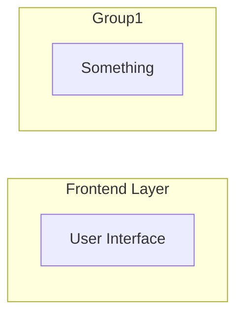

### Direction Within Subgraphs

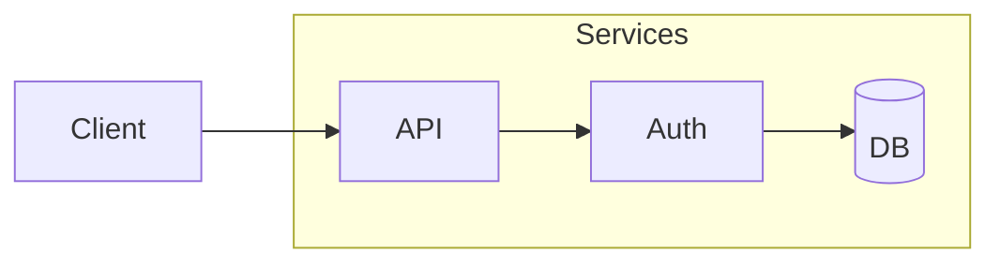

### Consistent Grouping Criteria

Pick one grouping strategy:
- By layer (presentation, business, data)
- By domain (users, orders, inventory)
- By deployment (frontend, backend, database)
- By team ownership

## Nesting Depth Guidelines

**Recommended: Maximum 2-3 levels**

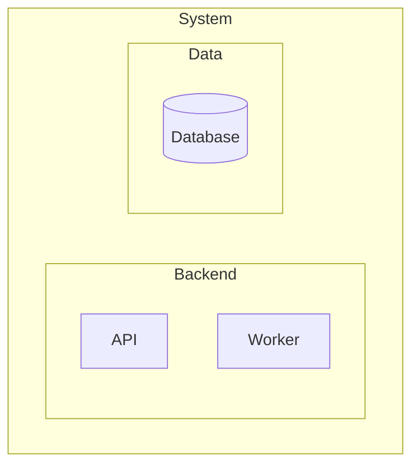

**Avoid: Deep nesting (4+ levels)**

Deep nesting causes:
- Rendering issues
- Cramped layouts
- Readability problems

**Solution**: Split into multiple diagrams or flatten hierarchy.

## Cross-Subgraph Connections

### Clean Connections

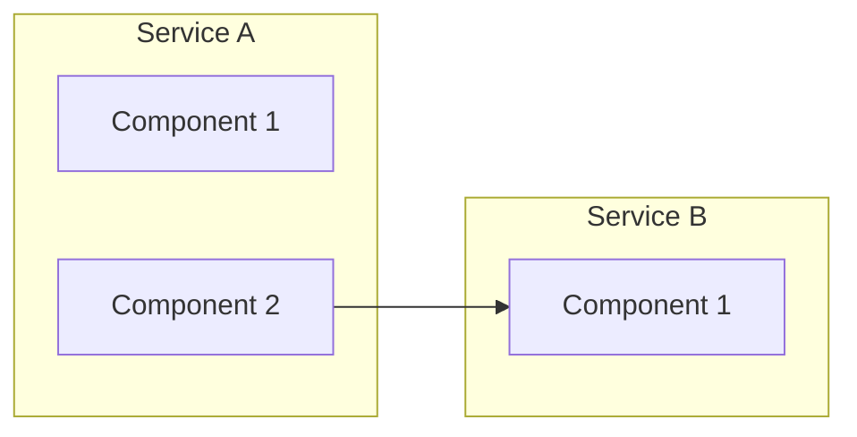

### Minimize Crossing Lines

Place subgraphs to reduce edge crossings:

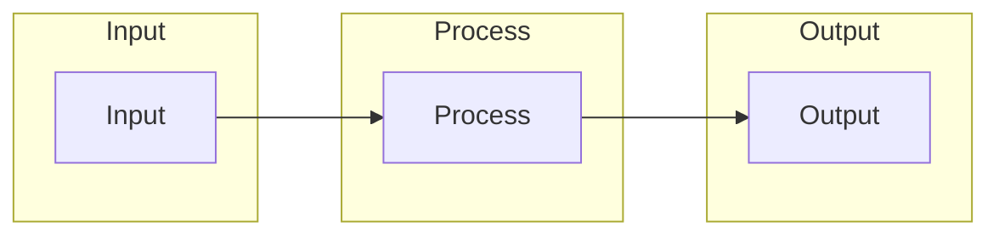

## Reducing Edge Crossings

### Strategy 1: Change Direction

If TD has many crossings, try LR:

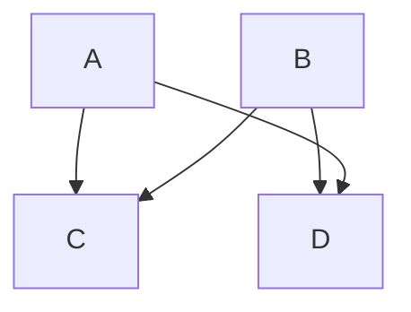

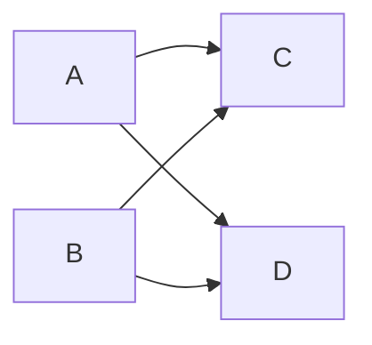

### Strategy 2: Reorder Nodes

Node declaration order affects layout:

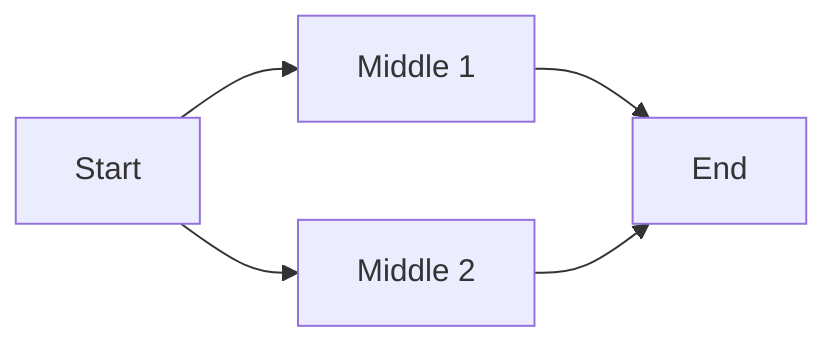

### Strategy 3: Invisible Links

Use invisible links to influence positioning:

```mermaid
flowchart LR
    A --> B
    C --> D
    B ~~~ C  %% Invisible link for spacing
```

## Direction Strategies by Diagram Type

| Diagram Type | Recommended Direction | Reason |
|--------------|----------------------|--------|
| Process flow | LR | Natural reading order |
| Hierarchy/tree | TD | Parent-child relationship |
| Timeline | LR | Chronological order |
| Data flow | LR or TD | Depends on context |
| Architecture | TD or LR | Depends on layers |

## Large Diagram Strategies

### Split by Concern

Instead of one massive diagram, create multiple focused diagrams:
- Overview diagram (high-level components)
- Detail diagrams (each component's internals)

### Use Link Nodes

Reference other diagrams:

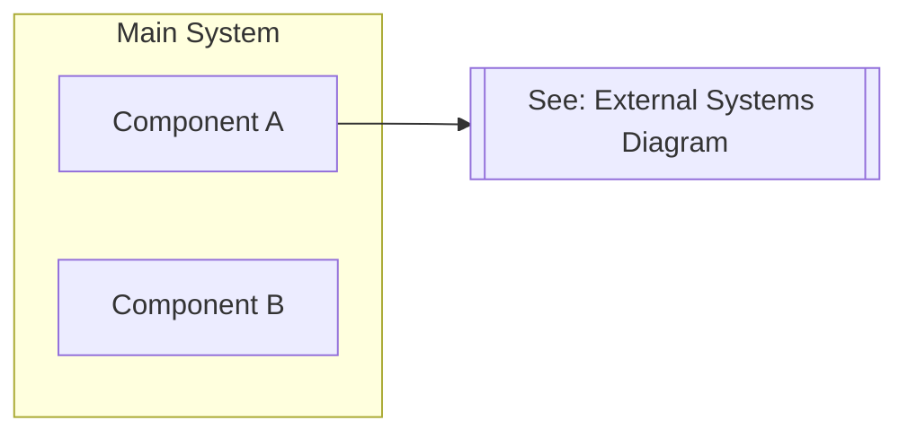

### Progressive Disclosure

Show detail levels:

```mermaid
%% Level 1: High-level
flowchart LR
    Client --> Server --> Database

%% Level 2: Expand Server (separate diagram)
flowchart LR
    subgraph Server
        LB[Load Balancer]
        API[API Server]
        Cache[Cache]
    end
```

## Common Layout Mistakes

### Mistake: Everything in One Subgraph

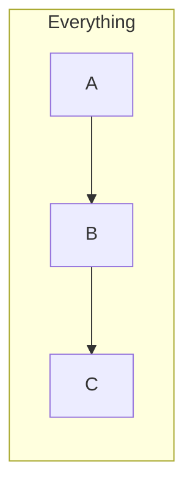

### Mistake: Crossing Subgraph Boundaries Excessively

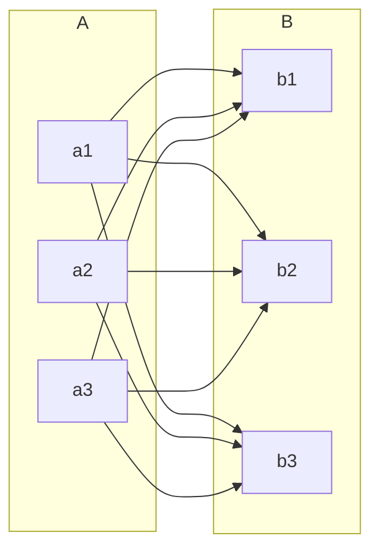

**Solution**: Group connections or use an intermediary node.

### Mistake: Inconsistent Direction

```mermaid
%% Confusing: Mixed directions
flowchart LR
    A --> B
    B --> C
    D --> B  %% Goes against flow
```

**Solution**: Maintain consistent flow direction.
