# Mermaid Syntax Quick Reference

Quick lookup for node shapes, arrows, styling, and common syntax patterns.

## Node Shapes (Flowchart)

| Shape | Syntax | Use Case |
|-------|--------|----------|
| Rectangle | `A[Text]` | Process, action, step |
| Rounded | `A(Text)` | Start/end, general node |
| Stadium | `A([Text])` | Terminal, start/end |
| Subroutine | `A[[Text]]` | Subprocess, function call |
| Database | `A[(Text)]` | Database, storage |
| Circle | `A((Text))` | Connector, junction |
| Diamond | `A{Text}` | Decision, condition |
| Hexagon | `A{{Text}}` | Preparation, setup |
| Parallelogram | `A[/Text/]` | Input |
| Parallelogram Alt | `A[\Text\]` | Output |
| Trapezoid | `A[/Text\]` | Manual operation |
| Trapezoid Alt | `A[\Text/]` | Manual input |
| Double Circle | `A(((Text)))` | Stop |

**Visual Reference**:
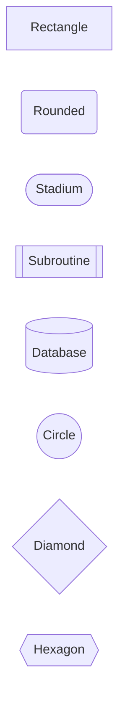

## Arrow Types (Flowchart)

| Arrow | Syntax | Description |
|-------|--------|-------------|
| Solid arrow | `A --> B` | Standard connection |
| Solid line | `A --- B` | Connection without arrow |
| Dotted arrow | `A -.-> B` | Optional or async |
| Dotted line | `A -.- B` | Weak relationship |
| Thick arrow | `A ==> B` | Emphasized connection |
| Thick line | `A === B` | Strong relationship |
| With label | `A -->|label| B` | Labeled connection |
| With label alt | `A --label--> B` | Alternative label syntax |
| Multidirectional | `A <--> B` | Bidirectional |

**Arrow Length**:
```
A --> B      Normal
A ---> B     Longer
A ----> B    Even longer
```

**Combined Example**:
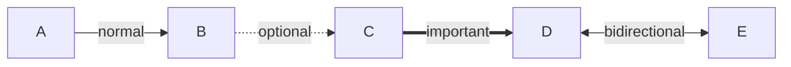

## Sequence Diagram Arrows

| Arrow | Syntax | Description |
|-------|--------|-------------|
| Solid with arrow | `->>` | Synchronous message |
| Dotted with arrow | `-->>` | Response, return |
| Solid with cross | `-x` | Lost message |
| Dotted with cross | `--x` | Lost async |
| Solid open arrow | `-)` | Async message |
| Dotted open arrow | `--)` | Async response |

## Direction Keywords

| Keyword | Direction | Best For |
|---------|-----------|----------|
| `TD` or `TB` | Top to Down | Hierarchies, trees |
| `LR` | Left to Right | Processes, timelines |
| `BT` | Bottom to Top | Bottom-up flows |
| `RL` | Right to Left | Reverse processes |

## Subgraph Syntax

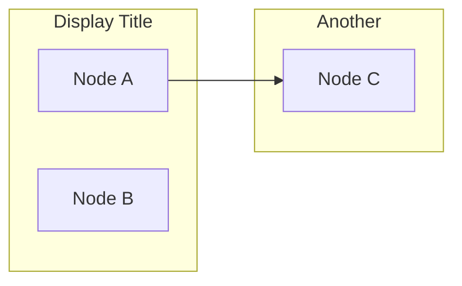

**Nested Subgraphs**:
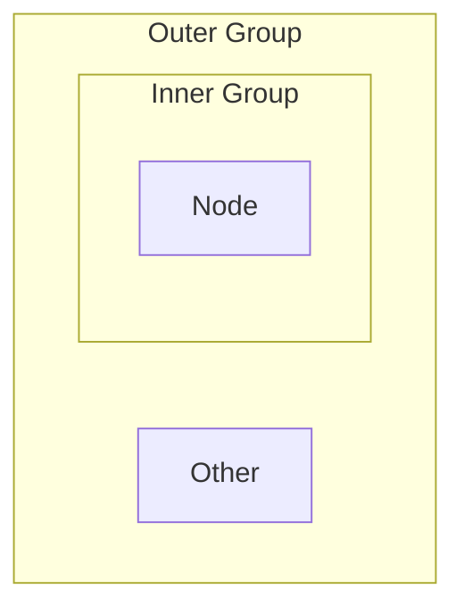

## Styling

### Class Definitions

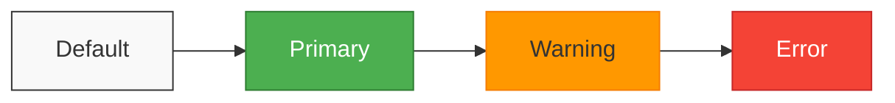

### Inline Styles

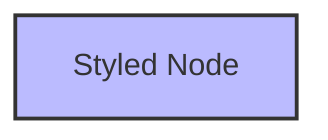

### Link Styles

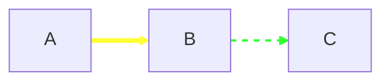

### Subgraph Styling

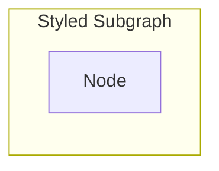

## Text Formatting

### Line Breaks

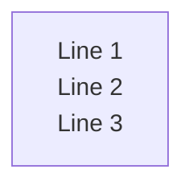

### Special Characters

Characters that need quoting: `()[]{}|<>` and reserved words

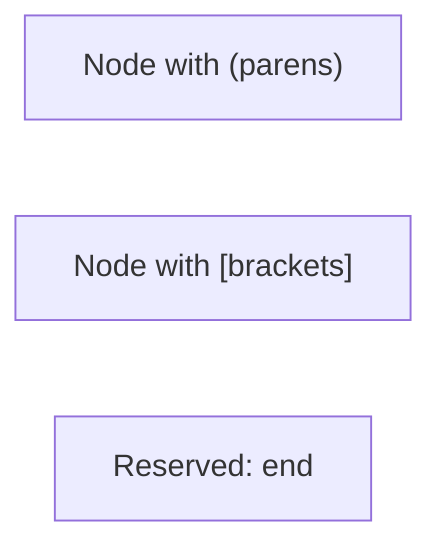

### Unicode and Emoji

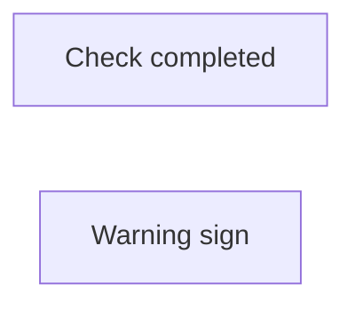

## Comments

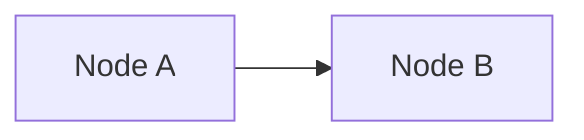

## Common Patterns

### Decision Tree

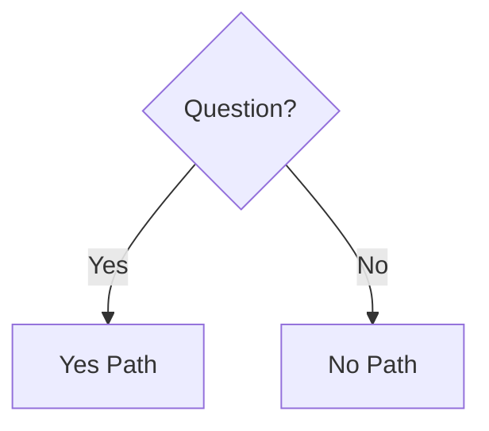

### Pipeline

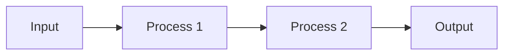

### Parallel Processing

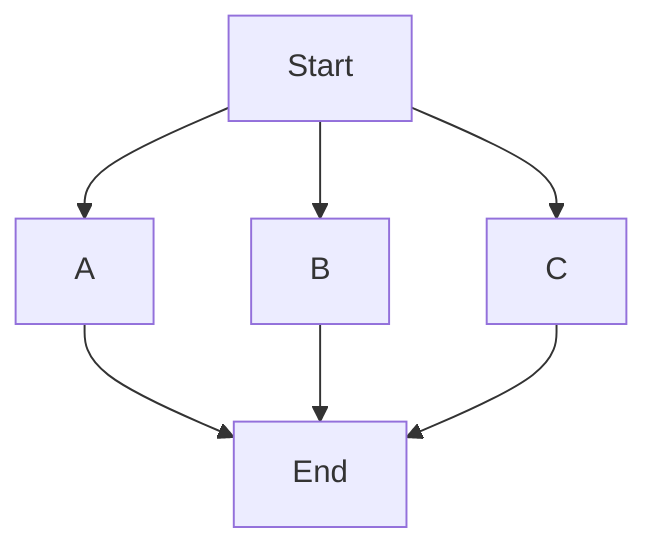

### Loop Back

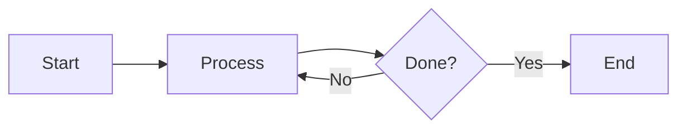

## Escape Sequences

| Character | Escape |
|-----------|--------|
| `#` | `#35;` |
| `;` | `#59;` |
| Quote in string | Use different quotes |

## Configuration (Directives)

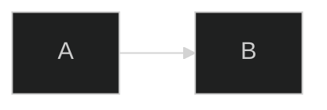

Common themes: `default`, `dark`, `forest`, `neutral`
