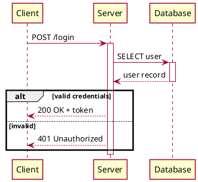
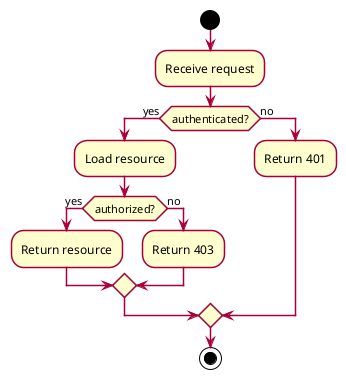
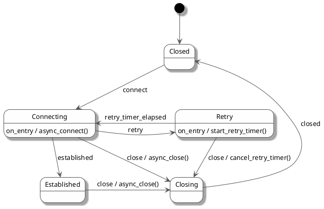

# Authoring PlantUML Diagrams

Generate `.puml` files for sequence, activity, and state diagrams. Validate with the `plantuml` CLI.

## Diagram Type Selection

| User intent | Diagram type |
|---|---|
| Interactions between actors/services over time | Sequence |
| Process flow with branching, loops, parallel paths | Activity |
| Object lifecycle with states and transitions | State |

## Workflow

1. Determine the diagram type from user intent
2. Read the corresponding reference for syntax:
   - `references/sequence.md` -- participants, messages, grouping, notes
   - `references/activity.md` -- conditionals, loops, forks, swimlanes
   - `references/state.md` -- states, transitions, composite states, concurrency
3. Read `references/layout.md` for layout techniques relevant to the diagram type
4. Write the `.puml` file, applying layout techniques upfront
5. Validate syntax: `uv run scripts/validate.py diagram.puml`
6. Fix any errors and re-validate
7. Render and visually inspect (see below)
8. Iterate on layout if needed

## Structure Conventions

Every diagram follows this order:

```
@startuml
' -- Styling (brief) --
' -- Declarations (participants / states) --
' -- Relationships / Flow --
@enduml
```

Declare entities upfront so the reader sees all participants/states before the logic.

## Styling

Keep styling minimal. Use `skin rose` as a sensible default plus a small `skinparam` block when needed. The styling block must never rival the diagram logic in size.

### Default base

```plantuml
skin rose
skinparam shadowing false
skinparam defaultFontSize 13
```

### Per-diagram skinparam

Sequence:
```plantuml
skinparam sequence {
  ArrowColor #555555
  ParticipantBorderColor #555555
  ParticipantBackgroundColor #FEFEFE
  LifeLineBorderColor #AAAAAA
}
```

Activity:
```plantuml
skinparam activity {
  BackgroundColor #FEFEFE
  BorderColor #555555
  ArrowColor #555555
}
```

State:
```plantuml
skinparam state {
  BackgroundColor #FEFEFE
  BorderColor #555555
  ArrowColor #555555
  FontSize 13
}
```

### Inline color for emphasis

Highlight specific elements sparingly:
```plantuml
state Error #FFaaaa
participant "Gateway" as GW #LightBlue
#PaleGreen:Approved;
```

## Quick Examples

### Sequence



### Activity



### State



## Validation

After writing a `.puml` file, validate syntax:

```bash
uv run scripts/validate.py diagram.puml
```

This runs `plantuml -syntax` and reports errors with line numbers. Fix any errors and re-validate before delivering.

## Visual Inspection

After syntax validation passes, render the diagram and inspect the output:

```bash
uv run scripts/render.py diagram.puml
```

This produces a PNG next to the source file. Open and inspect it using the Read tool.

### Inspection Checklist

- **Readability** -- All text legible, no overlapping labels
- **Edge crossings** -- Minimized; try a different direction (`left to right direction` vs `top to bottom direction`) or arrow direction hints if excessive
- **Logical grouping** -- Related nodes grouped via packages, boxes, or composite states where beneficial
- **Consistent shapes** -- Same node shape for similar concepts
- **Flow direction** -- Consistent and intuitive (usually LR for processes, TD for hierarchies)
- **Labels** -- Edge labels present where needed for clarity
- **Spacing** -- Nodes not too cramped or too spread out; adjust `nodesep`/`ranksep` if needed
- **Color usage** -- Styling aids understanding, not just decoration

### Fixing Layout Issues

If the rendered diagram has layout problems, consult `references/layout.md` for targeted techniques:

- **Too many edge crossings** -- Try swapping `top to bottom direction` / `left to right direction`, or add arrow direction hints (`-down->`, `-right->`)
- **Nodes overlapping or cramped** -- Increase `skinparam nodesep` / `skinparam ranksep`, or use longer arrows (`--->`)
- **Unrelated nodes too close** -- Add `A -[hidden]-> B` links to push them apart
- **Cross-cutting links distorting layout** -- Use `A -[norank]-> B` so the link renders without affecting positioning
- **Elements in wrong spatial position** -- Use arrow direction keywords (`-left->`, `-right->`, `-up->`, `-down->`)

After making layout changes, re-render and re-inspect. Iterate until the diagram is clear.

## Reference Files

| File | When to read |
|---|---|
| `references/sequence.md` | Building a sequence diagram |
| `references/activity.md` | Building an activity diagram |
| `references/state.md` | Building a state diagram |
| `references/layout.md` | Improving visual layout for any diagram type |
