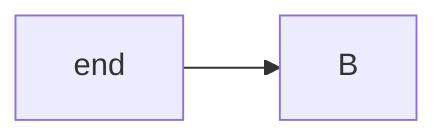
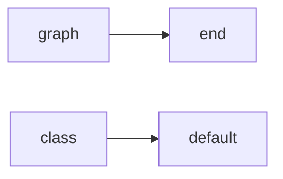

# Mermaid Common Issues and Troubleshooting

Quick reference for fixing common problems and ensuring diagram quality.

## Fixing Common Issues

| Issue | Symptom | Cause | Fix |
|-------|---------|-------|-----|
| Parse error | Diagram doesn't render | Reserved word or special character | Wrap text in quotes: `["end"]` |
| Wrong arrows | Arrows not appearing | Wrong syntax for diagram type | Flowchart: `-->`, Sequence: `->>` |
| Broken subgraph | Nodes outside group | Missing `end` keyword | Add `end` after subgraph contents |
| Direction ignored | Nodes don't flow correctly | Direction declared after nodes | Put direction first: `flowchart LR` |
| Timeline order wrong | Sequence out of order | Participants not declared | Declare participants in intended order |
| Node overlap | Text overlapping | Long labels | Use line breaks: `<br/>` |
| Too many crossings | Messy diagram | Poor node order or direction | Reorder declarations or change direction |
| Styling not applied | Colors not showing | Class not defined or typo | Check `classDef` and `:::` syntax |
| Subgraph link fails | Can't link to subgraph | Linking to group ID | Link to nodes inside subgraph instead |
| Special chars break | Syntax error | Unescaped characters | Quote the text or use escape codes |
| Text clipped | Labels cut off in SVG | Font metrics mismatch | Use config with arial font + padding |

## Error Message Reference

### "Parse error on line X"

**Cause**: Syntax error at the specified line.

**Common culprits**:
- Unquoted reserved word (`end`, `graph`, `subgraph`)
- Missing arrow syntax (`->` instead of `-->`)
- Unbalanced brackets or quotes
- Special characters in unquoted text

**Fix**:

Bad (will fail - `end` is reserved):
```
flowchart LR
    A[end] --> B
```

Good:


### "Maximum text size exceeded"

**Cause**: Node label too long.

**Fix**: Shorten text or use abbreviations with a legend.

### "Syntax error: unexpected token"

**Cause**: Invalid syntax structure.

**Check**:
- Diagram type declaration is first (`flowchart LR`)
- All subgraphs have `end`
- Arrow syntax matches diagram type

### "Cannot read property of undefined"

**Cause**: Reference to non-existent node.

**Fix**: Ensure all referenced nodes are declared.

## Reserved Words

These must be quoted when used as labels:

**Core keywords**:
- `graph`, `flowchart`, `subgraph`, `end`
- `direction`, `click`, `call`, `href`

**Styling keywords**:
- `style`, `class`, `classDef`, `linkStyle`
- `default`

**Sequence diagram**:
- `participant`, `actor`, `activate`, `deactivate`
- `loop`, `alt`, `else`, `opt`, `par`, `and`
- `note`, `over`, `rect`

**State diagram**:
- `state`, `note`

**Example fix**:


## Validation Commands

### Basic Syntax Check

```bash
mmdc -i diagram.mmd -o diagram.svg 2>&1
```

### With Configuration

```bash
mmdc -i diagram.mmd -o diagram.svg -c config.json
```

### Batch Validation

```bash
for f in *.mmd; do mmdc -i "$f" -o "${f%.mmd}.svg" 2>&1; done
```

## Debugging Steps

1. **Isolate the problem**: Remove parts of the diagram until it renders
2. **Check syntax**: Verify arrow types, brackets, quotes
3. **Simplify**: Replace complex labels with simple text
4. **Check reserved words**: Quote any that might be keywords
5. **Verify structure**: Ensure all blocks are closed (`end` for subgraphs)

## Rendering Differences

Different renderers may produce slightly different outputs:

| Renderer | Notes |
|----------|-------|
| mmdc (CLI) | Most reliable, use for validation |
| GitHub | May have version differences |
| VS Code extension | Preview may differ from export |
| Online editor | Good for quick testing |

**Best practice**: Validate with mmdc before committing.

## Text Clipping in SVG Output

**Symptom**: Text in nodes or edge labels appears cut off (e.g., "trade" shows as "trad", "partially_filled" shows as "partially_fille").

**Cause**: Mermaid calculates text bounding boxes using font metrics that may differ from the actual rendering environment. The default font ("trebuchet ms") has inconsistent metrics across systems.

**Fix**: Use the default config file included with the validation script, which:
- Uses `arial,sans-serif` font (widely available, predictable metrics)
- Increases padding in state diagrams (`padding: 16`, `textHeight: 20`)
- Adds extra spacing for flowcharts

The `validate_mermaid.py` script automatically uses this config. To disable it:
```bash
uv run scripts/validate_mermaid.py diagram.mmd --no-config
```

To use a custom config:
```bash
uv run scripts/validate_mermaid.py diagram.mmd -c my-config.json
```

**Manual fix** (if not using the script): Create a config file:
```json
{
  "themeVariables": {
    "fontFamily": "arial,sans-serif"
  },
  "state": {
    "padding": 16,
    "textHeight": 20
  }
}
```

Then pass to mmdc: `mmdc -i diagram.mmd -o diagram.svg -c config.json`

## Performance Issues

### Large Diagrams

Symptoms: Slow rendering, browser freeze

Solutions:
- Split into multiple smaller diagrams
- Reduce node count (combine related items)
- Simplify styling (fewer custom classes)

### Complex Layouts

Symptoms: Excessive edge crossings, poor auto-layout

Solutions:
- Declare nodes in visual order
- Use explicit positioning with invisible links (`~~~`)
- Change direction (TD vs LR)

## Quick Fixes Summary

| Problem | Quick Fix |
|---------|-----------|
| Won't parse | Quote all node labels |
| Wrong direction | Move direction to first line |
| Messy layout | Try opposite direction (TD ↔ LR) |
| Subgraph broken | Check for `end` keyword |
| Arrows missing | Use `-->` not `->` |
| Style not working | Check `classDef` before use |
| Sequence order wrong | Declare participants first |
| Text clipped in SVG | Use config with arial font and increased padding |
