# Mermaid Diagram Types Reference

Detailed syntax, examples, and guidance for each supported diagram type.

## 1. Flowchart

**Purpose**: Visualize processes, decisions, algorithms, and workflows.

**When to Use**:
- Documenting step-by-step processes
- Decision trees and branching logic
- Algorithm visualization
- User journey flows

**Basic Syntax**:
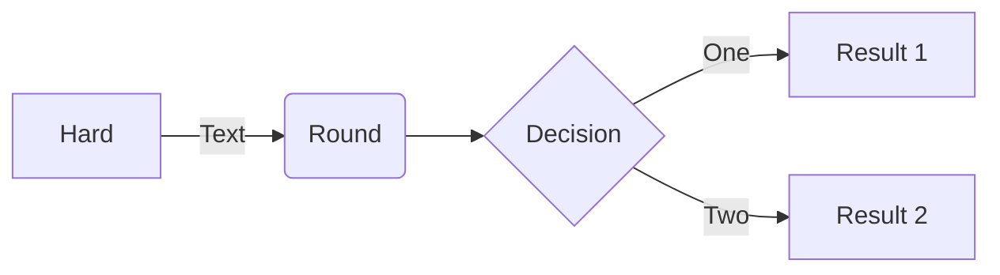

**Direction Options**:
- `flowchart TD` - Top to bottom (default)
- `flowchart LR` - Left to right
- `flowchart BT` - Bottom to top
- `flowchart RL` - Right to left

**Key Features**:
- Multiple node shapes for different meanings
- Subgraphs for logical grouping
- Edge labels for conditions
- Styling with classes

**Complete Example**:
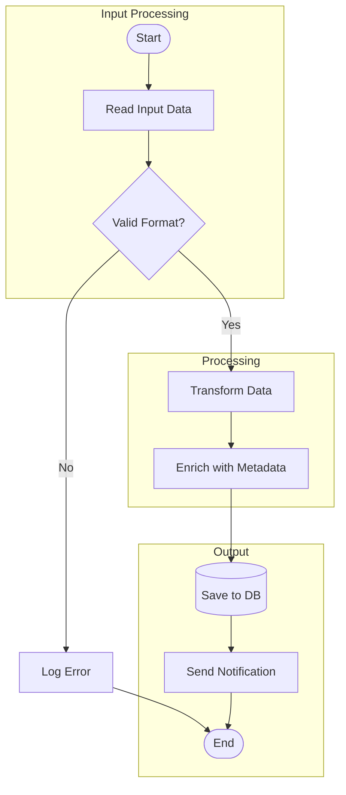

**vs Sequence Diagram**: Use flowchart when focus is on process steps; use sequence diagram when focus is on communication between actors.

---

## 2. Sequence Diagram

**Purpose**: Show interactions between components over time.

**When to Use**:
- API call documentation
- Message passing between services
- Request/response flows
- Protocol documentation

**Basic Syntax**:
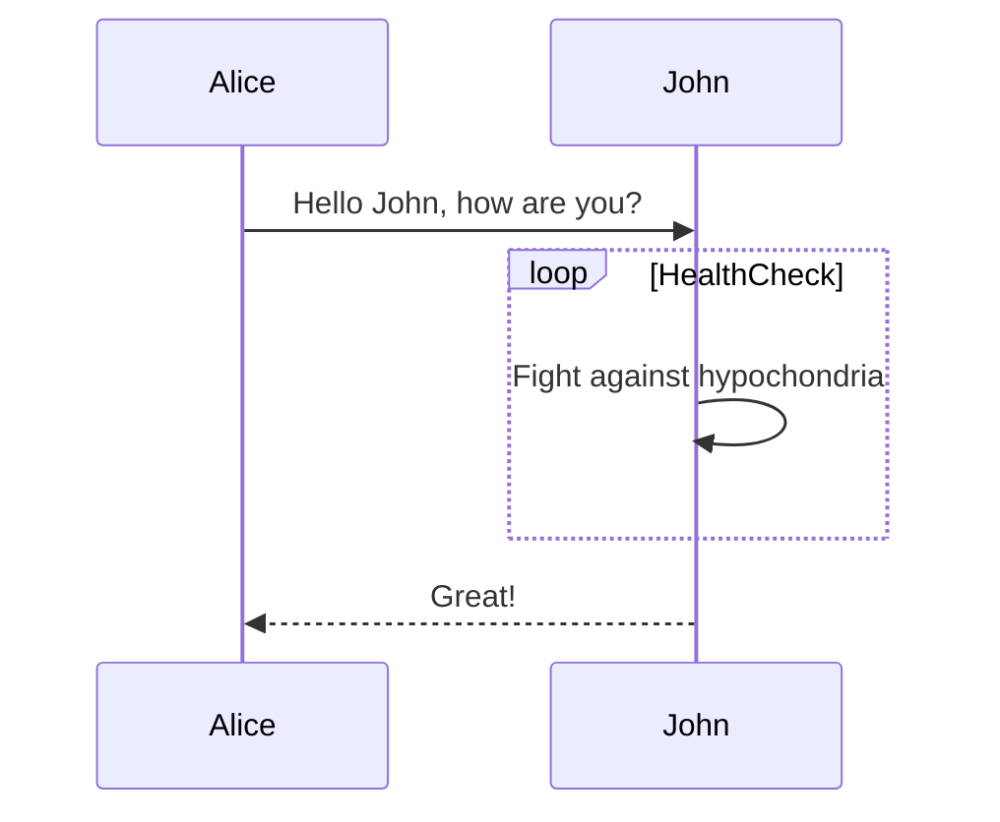

**Arrow Types**:
| Arrow | Description |
|-------|-------------|
| `->` | Solid line without arrow |
| `-->` | Dotted line without arrow |
| `->>` | Solid line with arrow |
| `-->>` | Dotted line with arrow |
| `-x` | Solid line with cross |
| `--x` | Dotted line with cross |
| `-)` | Solid line with open arrow (async) |
| `--)` | Dotted line with open arrow (async) |

**Key Features**:
- Participant declaration and aliases
- Activation/deactivation boxes
- Notes (left, right, over)
- Loops, alternatives, optionals, parallels

**Complete Example**:
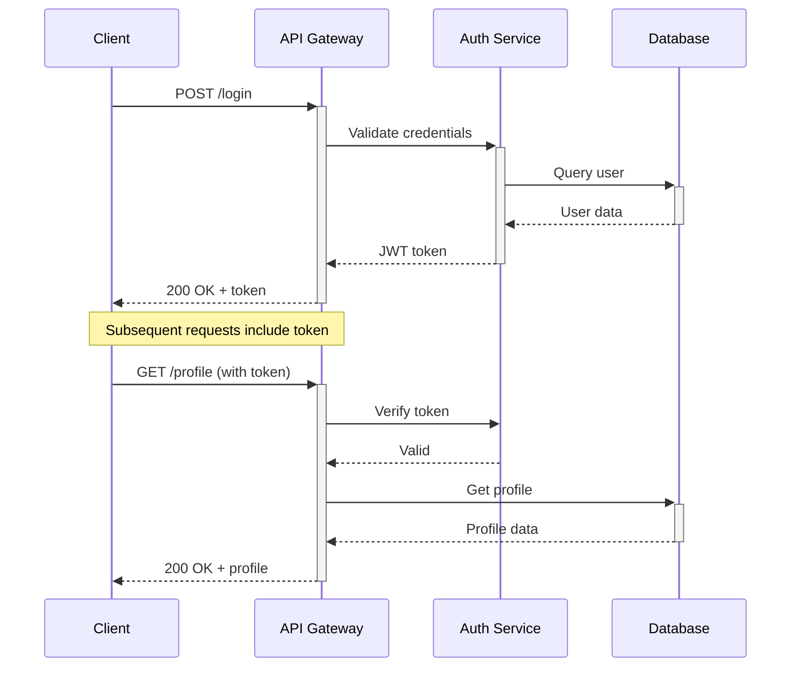

**Control Structures**:
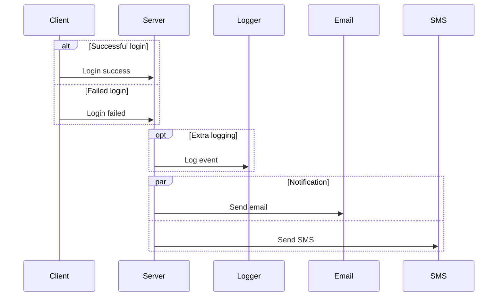

---

## 3. State Diagram

**Purpose**: Model state machines, lifecycles, and status transitions.

**When to Use**:
- Object lifecycle documentation
- Workflow states
- UI component states
- Protocol states

**Basic Syntax**:
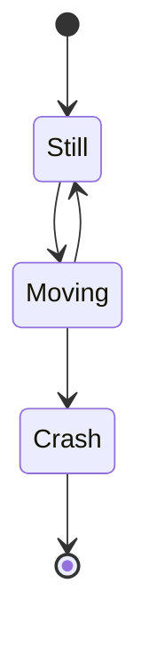

**Key Features**:
- Start `[*]` and end `[*]` states
- Composite states (nested)
- Forks and joins
- Notes and descriptions
- Choice pseudostates

**Complete Example**:
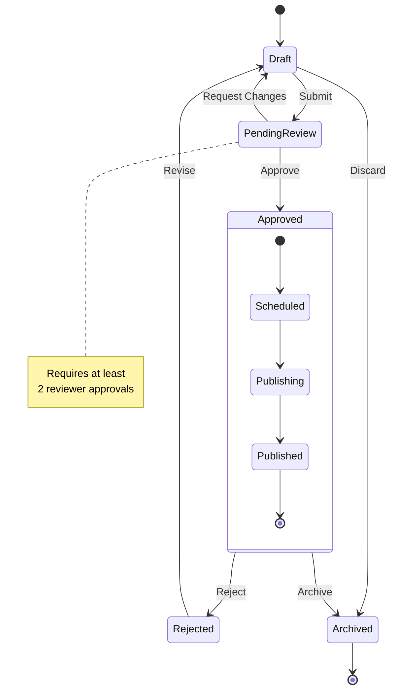

**Composite States**:
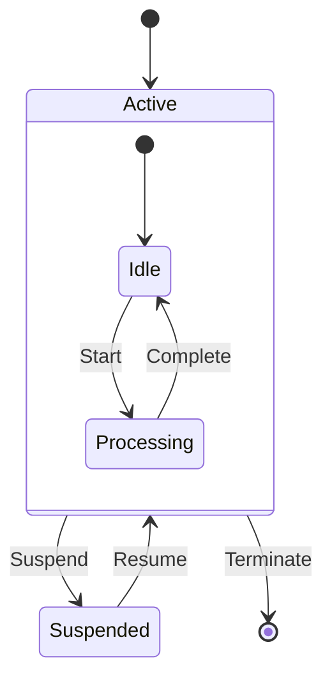

**vs Flowchart**: Use state diagram when modeling states of a single entity; use flowchart when modeling a process with multiple actors.

---

## 4. Class Diagram

**Purpose**: Document object-oriented design, type relationships, and class structure.

**When to Use**:
- OOP design documentation
- API type hierarchies
- Domain modeling
- Interface documentation

**Basic Syntax**:
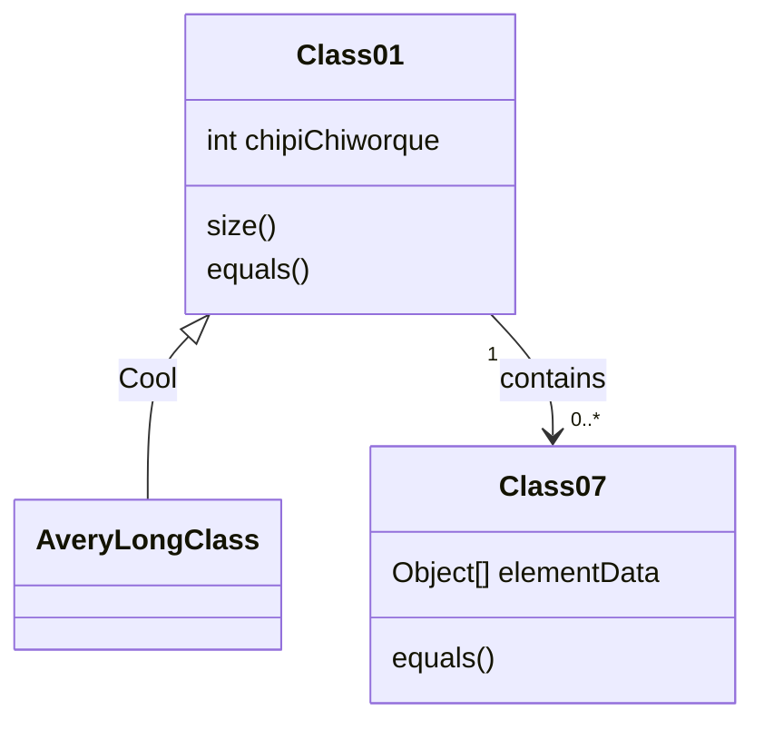

**Relationship Types**:
| Symbol | Type |
|--------|------|
| `<\|--` | Inheritance |
| `*--` | Composition |
| `o--` | Aggregation |
| `-->` | Association |
| `--` | Link (solid) |
| `..>` | Dependency |
| `..\|>` | Realization |
| `..` | Link (dashed) |

**Cardinality**:
- `"1"` - Exactly one
- `"0..1"` - Zero or one
- `"*"` - Many
- `"1..*"` - One or more
- `"n"` - n instances
- `"0..n"` - Zero to n

**Visibility Modifiers**:
- `+` Public
- `-` Private
- `#` Protected
- `~` Package/Internal

**Complete Example**:
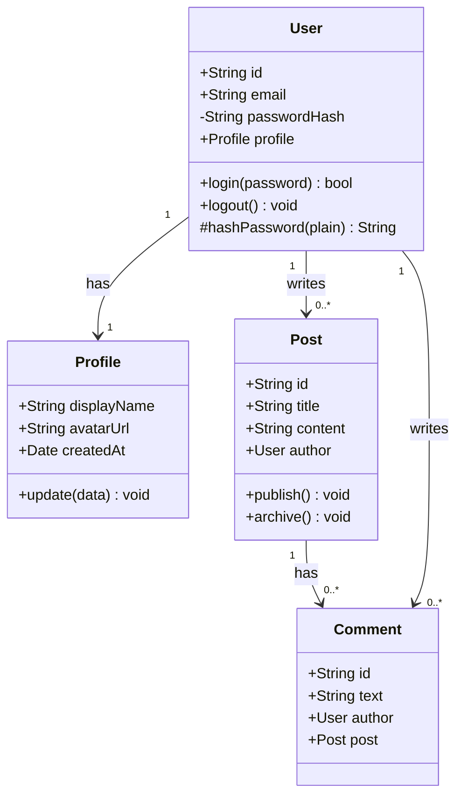

**Abstract and Interface**:
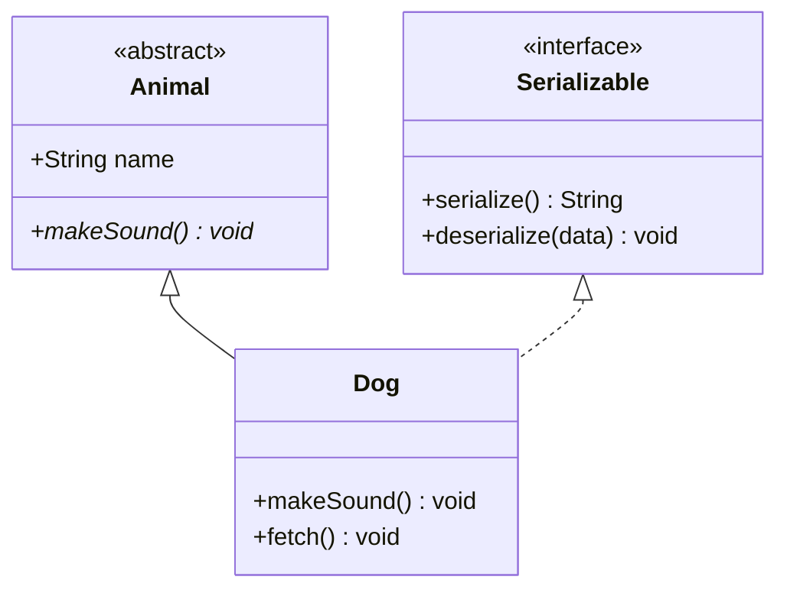

---

## 5. Entity Relationship Diagram

**Purpose**: Model database schemas and data relationships.

**When to Use**:
- Database design documentation
- Data modeling
- Schema visualization
- Migration planning

**Basic Syntax**:
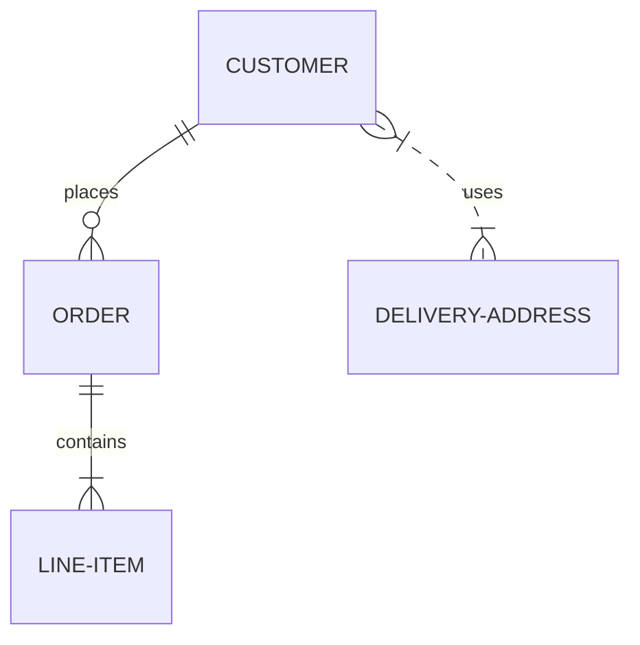

**Relationship Notation**:
| Left | Right | Meaning |
|------|-------|---------|
| `\|o` | `o\|` | Zero or one |
| `\|\|` | `\|\|` | Exactly one |
| `}o` | `o{` | Zero or more |
| `}\|` | `\|{` | One or more |

**Line Types**:
- `--` Solid (identifying)
- `..` Dashed (non-identifying)

**Complete Example**:
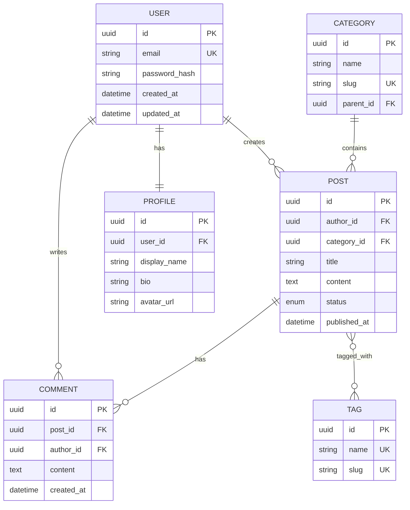

**Attribute Types**:
- Include data types after attribute name
- Use `PK` for primary key
- Use `FK` for foreign key
- Use `UK` for unique constraint

---

## 6. Architecture Diagram (C4/Block)

**Purpose**: Visualize system architecture, components, and their interactions.

**When to Use**:
- System design documentation
- Service architecture
- Infrastructure diagrams
- Component relationships

**Using Block Diagram**:
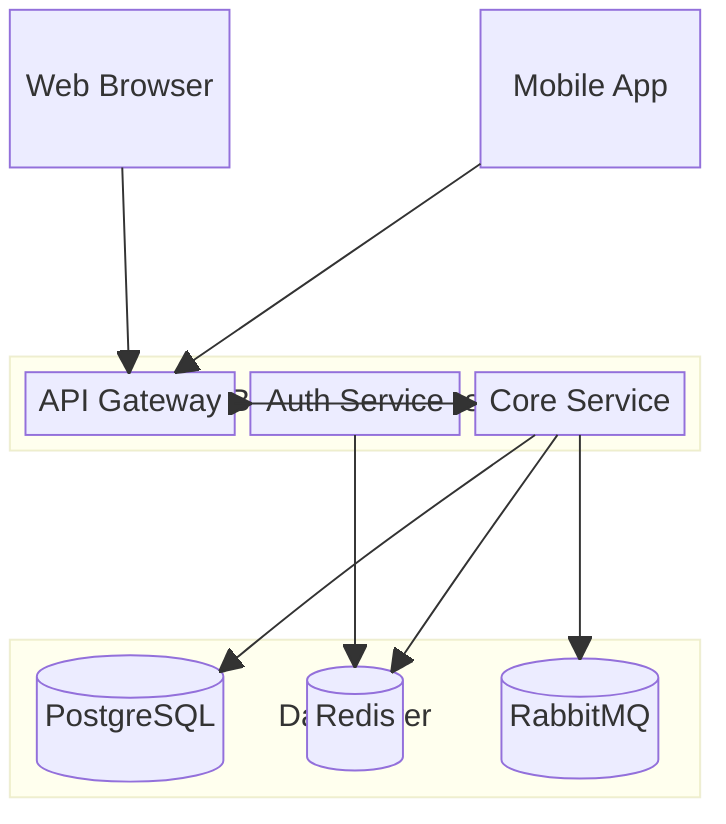

**Using Flowchart for Architecture**:
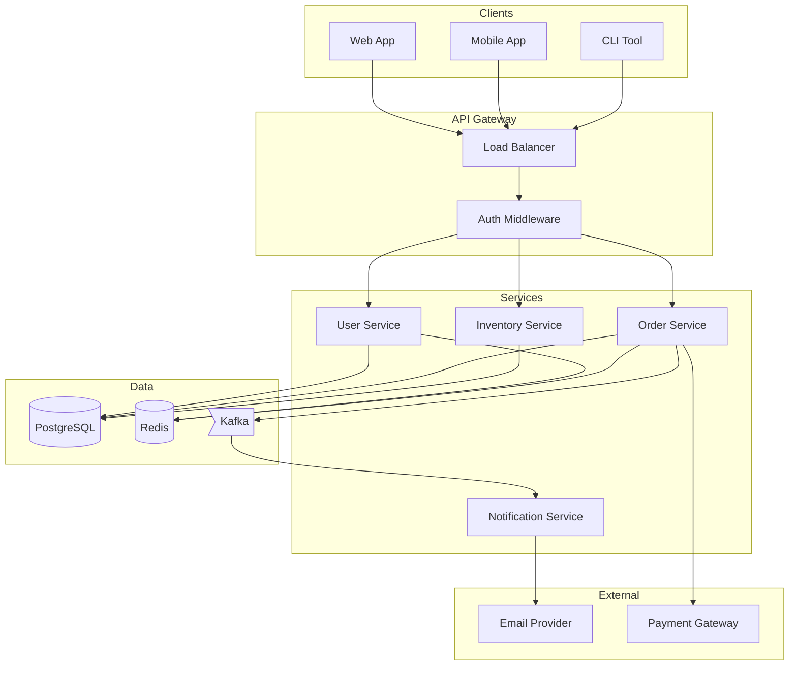

**Key Architecture Patterns**:

1. **Layered Architecture**:
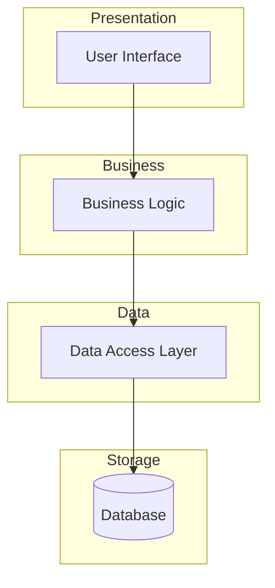

2. **Microservices**:
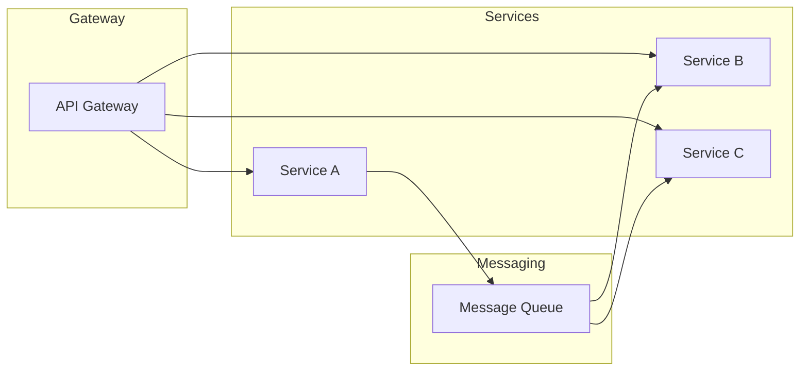

**vs Other Diagrams**: Use architecture diagrams for high-level system overview; use sequence diagrams for detailed interactions; use class diagrams for code-level design.
